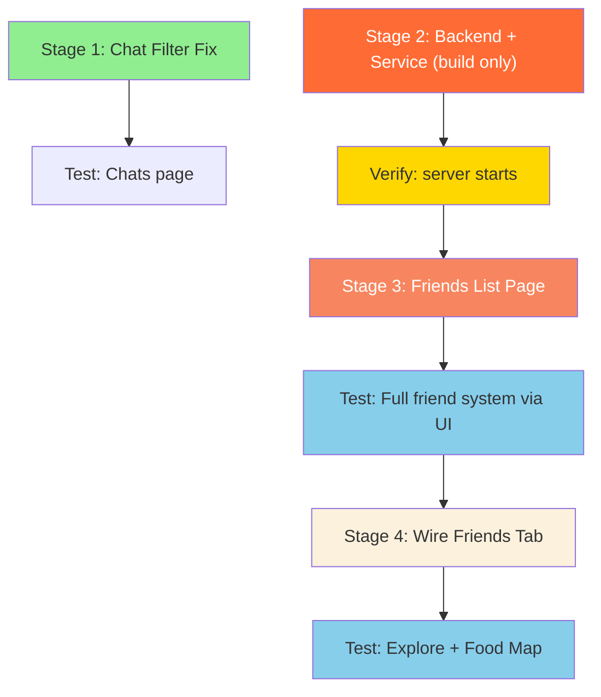

# Member 3 Workplan — Friend System

> **Role:** Member 3 — Friend System (Backend + Frontend)
> **Scope:** Build the complete friend system from scratch — backend API, frontend page, wiring into Explore/FoodMap friends tabs, and fixing the Chat filter bug.

---

## Overview

The `friendships` table already exists in the database (created in [004_create_admin_tables.sql](file:///c:/Users/Wang%20Song/Downloads/Grumble%20v2/grumble/grumble-backend/migrations/004_create_admin_tables.sql#L68-L78)):

```sql
CREATE TABLE IF NOT EXISTS friendships (
  id SERIAL PRIMARY KEY,
  user_id INTEGER REFERENCES users(id) ON DELETE CASCADE,
  friend_id INTEGER REFERENCES users(id) ON DELETE CASCADE,
  status VARCHAR(20) DEFAULT 'pending', -- 'pending', 'accepted', 'declined', 'blocked'
  created_at TIMESTAMP DEFAULT NOW(),
  updated_at TIMESTAMP DEFAULT NOW(),
  UNIQUE(user_id, friend_id),
  CHECK (user_id != friend_id)
);
```

Indexes on `user_id`, `friend_id`, and `status` already exist. **No migration work needed** — you're building the code layers on top of this table.

---

## Files You Will Create / Modify

### New Files

| File                                                                | Purpose                               |
| ------------------------------------------------------------------- | ------------------------------------- |
| `grumble-backend/repositories/friendsRepository.js`                 | Database queries for friendships      |
| `grumble-backend/controllers/friendsController.js`                  | Request handlers for friend API       |
| `grumble-backend/routes/friendRoutes.js`                            | Express route definitions             |
| `grumble-frontend/src/services/friendService.js`                    | Axios API calls for friend operations |
| `grumble-frontend/src/pages/FriendsList.jsx`                        | Friends list page UI                  |
| `grumble-frontend/src/components/friendsPage/FriendCard.jsx`        | Accepted friend row component         |
| `grumble-frontend/src/components/friendsPage/FriendRequestCard.jsx` | Pending request row component         |
| `grumble-frontend/src/components/friendsPage/AddFriendSearch.jsx`   | User search + send request component  |

### Modified Files

| File                                                     | Change                                  |
| -------------------------------------------------------- | --------------------------------------- |
| `grumble-backend/app.js`                                 | Mount `/api/friends` route              |
| `grumble-backend/repositories/postsRepository.js`        | Update `getFeedPosts` friends-tab query |
| `grumble-frontend/src/router.jsx`                        | Add `/friends` route                    |
| `grumble-frontend/src/components/layout/Sidebar.jsx`     | Add Friends nav item                    |
| `grumble-frontend/src/components/chatsPage/ChatList.jsx` | Fix `"friends"` → `"friend"` filter     |

---

## Pre-requisite: Set Up Test Accounts

Before testing anything, you need **at least 3 user accounts**. Do this once and keep them for all stages.

1. Open the app in **Browser Tab 1** → go to `/register` → create **User A** (e.g. username: `alice`, phone: `81111111`, password: `Password123!`)
2. Open the app in **Browser Tab 2** (use Incognito/Private window) → go to `/register` → create **User B** (e.g. username: `bob`, phone: `82222222`, password: `Password123!`)
3. Open the app in **Browser Tab 3** (another Incognito window, or a different browser) → go to `/register` → create **User C** (e.g. username: `charlie`, phone: `83333333`, password: `Password123!`)

> [!TIP]
> Keep all 3 tabs open and logged in throughout testing. This lets you quickly switch between accounts to test friend requests from both sides.

---

## Stage 1 — Fix Chat Friends Tab Filter Bug

### Objective

Fix the filter mismatch in `ChatList.jsx` where the "friends" tab checks for `c.type === "friends"` (plural) but the mock data uses `c.type === "friend"` (singular), causing the friends tab to show zero results.

### What to Modify

**[ChatList.jsx](file:///c:/Users/Wang%20Song/Downloads/Grumble%20v2/grumble/grumble-frontend/src/components/chatsPage/ChatList.jsx#L20)** — Line 20:

```diff
-      (activeTab === "friends" && c.type === "friends");
+      (activeTab === "friends" && c.type === "friend");
```

That's it — one character change.

### Why not change the mock data instead?

The mock data uses `"friend"` (singular) which is the correct/intended value — it represents a 1-on-1 chat with a friend (versus `"group"` for group chats). The tab label is "friends" (plural) because it means "show all friend chats", but each individual chat's type is `"friend"` (singular). So the filter logic should match the data, not the other way around.

### How to Test (Manual Navigation)

#### Test 1: Friends tab now shows friend chats

1. Open the app → log in with any account
2. Click **"Chats"** in the sidebar
3. You should see the full chat list with all chats (groups + friends)
4. Click the **"friends"** tab button at the top
5. **Expected result:** You should see **6 friend chats** listed: Friend 2, Friend 3, Friend 4, Friend 5, Friend 9, Friend 10. Each shows their last message and time.
6. **Before the fix (for comparison):** This tab shows "No chats found" with a 💬 emoji

#### Test 2: Other tabs still work correctly

1. On the same Chats page, click the **"all"** tab
2. **Expected result:** All 10 chats appear (6 friend + 4 group)
3. Click the **"groups"** tab
4. **Expected result:** Only 4 group chats appear: "Makan hang group", "Friday dinner group", "Family go-where eat", "Dinner after CCA"
5. Click **"friends"** tab again
6. **Expected result:** Only the 6 friend chats appear (same as Test 1)

#### Test 3: Search still works within friends tab

1. Stay on the **"friends"** tab
2. Type **"Friend 2"** in the search bar
3. **Expected result:** Only "Friend 2" chat appears in the filtered list
4. Clear the search bar
5. **Expected result:** All 6 friend chats reappear

---

## Stage 2 — Build the Friend System Backend + Frontend Service

### Objective

Build all the backend infrastructure (repository, controller, routes) and the frontend API service in one go. These 4 files are pure plumbing — no visible UI. They will be tested together in Stage 3 when the Friends page UI is built.

### What to Create

#### 2a. `grumble-backend/repositories/friendsRepository.js`

Create this file with all database query functions using the existing `pool` from `../config/db`. Implement these functions:

| Function                                  | SQL Operation                                                                                                            | Description                                                                                                                                                                                                                                                                                          |
| ----------------------------------------- | ------------------------------------------------------------------------------------------------------------------------ | ---------------------------------------------------------------------------------------------------------------------------------------------------------------------------------------------------------------------------------------------------------------------------------------------------- |
| `sendFriendRequest(userId, friendId)`     | `INSERT INTO friendships (user_id, friend_id, status) VALUES ($1, $2, 'pending')`                                        | Creates a pending request. Must handle duplicate requests (the UNIQUE constraint will throw an error — catch it and return a friendly message). Also check that a reverse row doesn't already exist (if B already sent a request to A, A sending to B should either auto-accept or return an error). |
| `acceptFriendRequest(requestId, userId)`  | `UPDATE friendships SET status = 'accepted', updated_at = NOW() WHERE id = $1 AND friend_id = $2 AND status = 'pending'` | Accept — only the **receiver** (friend_id) can accept. Return the updated row.                                                                                                                                                                                                                       |
| `declineFriendRequest(requestId, userId)` | `DELETE FROM friendships WHERE id = $1 AND friend_id = $2 AND status = 'pending'`                                        | Decline — delete the pending row. Only the receiver can decline.                                                                                                                                                                                                                                     |
| `removeFriend(friendshipId, userId)`      | `DELETE FROM friendships WHERE id = $1 AND (user_id = $2 OR friend_id = $2) AND status = 'accepted'`                     | Remove — either party can unfriend.                                                                                                                                                                                                                                                                  |
| `getFriends(userId)`                      | `SELECT ... FROM friendships f JOIN users u ON ... WHERE (f.user_id = $1 OR f.friend_id = $1) AND f.status = 'accepted'` | List accepted friends. Join with `users` to get `id`, `username`, `created_at` of the friend. Need to handle both directions (the friend could be in `user_id` or `friend_id` column).                                                                                                               |
| `getPendingRequests(userId)`              | `SELECT ... FROM friendships f JOIN users u ON u.id = f.user_id WHERE f.friend_id = $1 AND f.status = 'pending'`         | Incoming requests: rows where the current user is `friend_id` and status is `pending`.                                                                                                                                                                                                               |
| `getSentRequests(userId)`                 | `SELECT ... FROM friendships f JOIN users u ON u.id = f.friend_id WHERE f.user_id = $1 AND f.status = 'pending'`         | Outgoing pending requests sent by the current user.                                                                                                                                                                                                                                                  |
| `searchUsers(query, currentUserId)`       | `SELECT id, username FROM users WHERE username ILIKE $1 AND id != $2 LIMIT 20`                                           | Search users by username substring. Exclude self.                                                                                                                                                                                                                                                    |
| `getFriendIds(userId)`                    | Returns a flat array of friend user IDs. Used by the posts repo for the friends-tab feed query.                          |

> [!IMPORTANT]
> The friendships table has a **directional** design: `user_id` sends the request to `friend_id`. When listing accepted friends, you must check **both** directions: `WHERE (user_id = $1 OR friend_id = $1) AND status = 'accepted'`, then pick the "other" user's ID.

#### 2b. `grumble-backend/controllers/friendsController.js`

Follow the same pattern as [postsController.js](file:///c:/Users/Wang%20Song/Downloads/Grumble%20v2/grumble/grumble-backend/controllers/postsController.js) — each function extracts `req.user.id`, calls the repo, and returns JSON.

| Function                     | Reads from           | Calls                                      |
| ---------------------------- | -------------------- | ------------------------------------------ |
| `sendRequest(req, res)`      | `req.body.friendId`  | `repo.sendFriendRequest(userId, friendId)` |
| `acceptRequest(req, res)`    | `req.params.id`      | `repo.acceptFriendRequest(id, userId)`     |
| `declineRequest(req, res)`   | `req.params.id`      | `repo.declineFriendRequest(id, userId)`    |
| `removeFriend(req, res)`     | `req.params.id`      | `repo.removeFriend(id, userId)`            |
| `listFriends(req, res)`      | —                    | `repo.getFriends(userId)`                  |
| `listRequests(req, res)`     | —                    | `repo.getPendingRequests(userId)`          |
| `listSentRequests(req, res)` | —                    | `repo.getSentRequests(userId)`             |
| `searchUsers(req, res)`      | `req.query.username` | `repo.searchUsers(query, userId)`          |

Add `console.error` log lines in each `catch` block (like the postsController does) so errors appear in the server terminal.

#### 2c. `grumble-backend/routes/friendRoutes.js`

```js
const express = require("express");
const router = express.Router();
const authMiddleware = require("../middleware/authMiddleware");
const friendsController = require("../controllers/friendsController");

router.use(authMiddleware); // all routes require auth

router.get("/", friendsController.listFriends);
router.get("/requests", friendsController.listRequests);
router.get("/sent", friendsController.listSentRequests);
router.get("/search", friendsController.searchUsers);
router.post("/request", friendsController.sendRequest);
router.post("/accept/:id", friendsController.acceptRequest);
router.post("/decline/:id", friendsController.declineRequest);
router.delete("/:id", friendsController.removeFriend);

module.exports = router;
```

#### 2d. Mount routes in `app.js`

**[app.js](file:///c:/Users/Wang%20Song/Downloads/Grumble%20v2/grumble/grumble-backend/app.js)** — Add two lines:

```diff
 const postRoutes = require('./routes/postRoutes');
+const friendRoutes = require('./routes/friendRoutes');
 const errorHandler = require('./middleware/errorHandler');
```

```diff
 app.use('/api/posts', postRoutes);
+app.use('/api/friends', friendRoutes);
 app.use('/api/food-places', foodPlaceRoutes);
```

#### 2e. `grumble-frontend/src/services/friendService.js`

```js
import api from "./api";

export const getFriends = () => api.get("/friends");
export const getFriendRequests = () => api.get("/friends/requests");
export const getSentRequests = () => api.get("/friends/sent");
export const searchUsers = (username) =>
  api.get("/friends/search", { params: { username } });
export const sendFriendRequest = (friendId) =>
  api.post("/friends/request", { friendId });
export const acceptFriendRequest = (requestId) =>
  api.post(`/friends/accept/${requestId}`);
export const declineFriendRequest = (requestId) =>
  api.post(`/friends/decline/${requestId}`);
export const removeFriend = (friendshipId) =>
  api.delete(`/friends/${friendshipId}`);
```

### How to Test

**This stage has no UI** — you cannot test it by clicking through the app. The testing happens in **Stage 3** when the Friends List page is built on top of this code.

However, you should verify the **backend starts without crashing**:

1. **Stop** the backend if it's running (Ctrl+C in the terminal)
2. **Start** it again: run `node server.js` in the `grumble-backend` folder
3. **Expected result in the terminal:** You should see `Grumble server running on port 5001` (or whatever your start message is) with **no errors**
4. **If you see an error** like `Cannot find module './routes/friendRoutes'` or `SyntaxError`, it means one of your new files has a typo or missing export — fix it before proceeding

> [!TIP]
> If the server starts cleanly, all four new backend files are syntactically correct and properly connected. The actual logic will be tested through the UI in the next stage.

---

## Stage 3 — Friends List Page (Frontend UI)

### Objective

Build a complete `FriendsList` page with three sections: accepted friends, incoming requests, and a user search to send new requests. Add it to the router and sidebar navigation. **This is where you test everything from Stage 2 as well.**

### What to Create

#### 3a. `grumble-frontend/src/components/friendsPage/FriendCard.jsx`

A card/row for each accepted friend showing:

- Username initial avatar (same style as other pages — a colored circle with the first letter)
- Username text
- "Remove" button that calls `removeFriend(friendshipId)`
- After successful removal, the card should disappear from the list (call a callback prop like `onRemoved`)

#### 3b. `grumble-frontend/src/components/friendsPage/FriendRequestCard.jsx`

A card/row for each incoming request showing:

- Requester's username with initial avatar
- When the request was sent (format `created_at` as relative time like "2 days ago" or just the date)
- "Accept" button → calls `acceptFriendRequest(id)`, on success calls `onAccepted` callback
- "Decline" button → calls `declineFriendRequest(id)`, on success calls `onDeclined` callback

#### 3c. `grumble-frontend/src/components/friendsPage/AddFriendSearch.jsx`

A search component:

- Text input for username search
- On typing (debounced ~300ms), calls `searchUsers(query)` from friendService
- Shows results as a list of usernames
- Each result has an "Add Friend" button → calls `sendFriendRequest(userId)`
- After sending, change button to "Pending" (disabled)
- If the user is already a friend, show "Already Friends" (disabled)

#### 3d. `grumble-frontend/src/pages/FriendsList.jsx`

The main page component. Layout:

1. **Header** — "Friends" title with Grumble logo (same style as Explore, Chats pages)
2. **Pending Requests section** — shows a count badge + list of `FriendRequestCard`s. Only visible if there are pending requests.
3. **Search section** — the `AddFriendSearch` component
4. **Friends list** — list of `FriendCard`s showing all accepted friends
5. **Empty state** — "No friends yet. Search for users to connect!" when friends list is empty

State management:

```js
const [friends, setFriends] = useState([]);
const [requests, setRequests] = useState([]);
const [isLoading, setIsLoading] = useState(true);
```

Fetch friends and requests on mount via `useEffect`.

#### 3e. Router and Sidebar changes

**[router.jsx](file:///c:/Users/Wang%20Song/Downloads/Grumble%20v2/grumble/grumble-frontend/src/router.jsx)** — Add route:

```diff
 import Chats from './pages/Chats';
 import Profile from './pages/Profile';
+import FriendsList from './pages/FriendsList';
```

Inside the `MainLayout` children array:

```diff
       { path: 'chats', element: <Chats /> },
+      { path: 'friends', element: <FriendsList /> },
       { path: 'profile', element: <Profile /> }
```

**[Sidebar.jsx](file:///c:/Users/Wang%20Song/Downloads/Grumble%20v2/grumble/grumble-frontend/src/components/layout/Sidebar.jsx)** — Add nav item:

```diff
-import { Home, Search, Globe, MessageCircle, User, LogOut, ChevronLeft, ChevronRight } from 'lucide-react';
+import { Home, Search, Globe, MessageCircle, Users, User, LogOut, ChevronLeft, ChevronRight } from 'lucide-react';
```

```diff
     { id: 'chats', label: 'Chats', icon: MessageCircle, path: '/chats'},
+    { id: 'friends', label: 'Friends', icon: Users, path: '/friends'},
     { id: 'profile', label: 'Profile', icon: User, path: '/profile'},
```

### How to Test (Manual Navigation)

> [!IMPORTANT]
> Make sure both the backend (`node server.js` in grumble-backend) and frontend (`npm run dev` in grumble-frontend) are running before testing. Keep the **backend terminal visible** so you can check for errors printed by `console.error` in the controller.

---

#### Test 1: Page loads and sidebar navigation works

1. Log in as **User A** (alice) in Browser Tab 1
2. Look at the **sidebar** on the left
3. **Expected:** A new **"Friends"** menu item appears between "Chats" and "Profile" with a people/users icon
4. Click **"Friends"** in the sidebar
5. **Expected:** The Friends page loads. It should show:
   - The Grumble logo + "Friends" title at the top
   - An empty friends list with a message like "No friends yet" or similar empty state
   - A search bar/section to find users
   - No pending requests section (since there are none yet)
6. **Check the backend terminal** — there should be no error messages

---

#### Test 2: Search for users

1. On the Friends page as **User A**, find the search bar
2. Type **"bob"** in the search field
3. **Expected:** After a short delay (~300ms), a search results list appears showing **User B** (bob) with an "Add Friend" button next to their name
4. Clear the search bar and type **"alice"** (your own username)
5. **Expected:** No results appear, OR the results do not include yourself. You should not be able to add yourself as a friend
6. Type **"zzzznonexistent"** (a username that doesn't exist)
7. **Expected:** No results appear, or a message like "No users found"
8. Type just **one letter**, e.g. **"b"**
9. **Expected:** Any users whose username contains "b" should appear in the results

---

#### Test 3: Send a friend request

1. As **User A**, search for **"bob"** on the Friends page
2. Click the **"Add Friend"** button next to bob's name
3. **Expected:**
   - The button changes to **"Pending"** and becomes disabled/greyed out
   - No error messages appear
   - The friends list is still empty (bob hasn't accepted yet)
4. **Check the backend terminal** — no error messages should appear

---

#### Test 4: Receive and view a friend request

1. Switch to **Browser Tab 2** where **User B** (bob) is logged in
2. Navigate to the **Friends** page via the sidebar
3. **Expected:**
   - A **"Pending Requests"** section is visible
   - It shows **1 pending request** from **alice**
   - Each request has an **"Accept"** button and a **"Decline"** button
   - The friends list below is still empty

---

#### Test 5: Accept a friend request

1. As **User B** on the Friends page, click **"Accept"** on alice's friend request
2. **Expected:**
   - The pending request disappears from the requests section
   - **alice** now appears in the **friends list** below, showing the username and a "Remove" button
   - If alice was the only pending request, the entire "Pending Requests" section disappears
3. Switch to **Browser Tab 1** (User A / alice)
4. **Refresh** the Friends page (press F5, or navigate away and back)
5. **Expected:** **bob** now appears in alice's friends list with a "Remove" button

---

#### Test 6: Decline a friend request

1. As **User A** (alice), search for **"charlie"** and click **"Add Friend"**
2. **Expected:** Button changes to "Pending"
3. Switch to **Browser Tab 3** (User C / charlie)
4. Navigate to **Friends** page
5. **Expected:** Pending request from **alice** is shown
6. Click **"Decline"** on alice's request
7. **Expected:**
   - The pending request disappears
   - Alice does NOT appear in charlie's friends list
   - The friends list remains empty (or shows only other friends if any)
8. Switch back to **User A** (Browser Tab 1), refresh the Friends page
9. **Expected:** Charlie is NOT in alice's friends list. The "Pending" status next to charlie in search results should reset (if you search again, it should show "Add Friend" again, not "Pending")

---

#### Test 7: Remove a friend

1. As **User A** (alice), verify that **bob** is in the friends list
2. Click the **"Remove"** button next to bob
3. **Expected:**
   - Bob disappears from the friends list
   - If bob was the only friend, the empty state message appears again
4. Switch to **User B** (Browser Tab 2), refresh the Friends page
5. **Expected:** Alice is no longer in bob's friends list either — the removal is mutual

---

#### Test 8: Send a request to someone who already sent you one

1. As **User C** (charlie), search for **"alice"** and click **"Add Friend"** (charlie is sending to alice)
2. **Expected:** Button changes to "Pending"
3. Switch to **User A** (alice), go to Friends page
4. **Expected:** A pending request from **charlie** appears
5. Now as **User A**, try searching for **"charlie"** in the search bar
6. **Expected:** One of these behaviors (depends on your implementation):
   - Charlie appears but the button says **"Respond"** or **"Pending Request"** instead of "Add Friend" (because charlie already sent you a request)
   - OR charlie appears with "Add Friend" and clicking it **auto-accepts** the mutual request (both become friends immediately)
   - OR clicking "Add Friend" shows an error/message saying "This user already sent you a request — check your pending requests"
7. **Any of the above is acceptable** — the key is that it should NOT create a duplicate row or crash

---

#### Test 9: Duplicate friend request

1. As **User A**, send a friend request to **User B** (if not already friends)
2. Search for **"bob"** again
3. **Expected:** The button next to bob should show **"Pending"** (disabled), NOT "Add Friend". You should not be able to send a duplicate request
4. **Check the backend terminal** — no database constraint errors should appear

---

#### Test 10: Attempting to befriend yourself

1. As **User A**, search for **"alice"** (your own username) in the search bar
2. **Expected:** Your own account should NOT appear in the search results at all (the `searchUsers` function excludes the current user's ID)
3. If it does appear and you click "Add Friend":
   - **Expected:** An error message appears (the database CHECK constraint `user_id != friend_id` will block this)
   - **Check the backend terminal** — you may see an error logged, but it should be handled gracefully (no server crash)

---

#### Test 11: Page state after browser refresh

1. As **User A**, make sure you have at least 1 friend and 1 pending request
2. Press **F5** to hard-refresh the page
3. **Expected:** The friends list and pending requests reload correctly — nothing is lost. Data comes from the database, not just React state

---

#### Test 12: Backend error handling

1. **Stop the backend** (Ctrl+C in the backend terminal)
2. Go to the Friends page in the browser and try to load it or search for users
3. **Expected:** The page shows an error state or "Failed to load" message — it should NOT show a white screen or crash. The browser console (F12 → Console tab) may show network errors, which is expected.
4. **Restart the backend** (`node server.js`)
5. Refresh the Friends page
6. **Expected:** Everything loads normally again

---

## Stage 4 — Wire the Friends Tab (Explore + Food Map)

### Objective

Make the "Friends" tab on both the Explore page and Food Map page actually show posts from the user's accepted friends, instead of falling back to "For You" content.

### What to Modify

#### 4a. [postsRepository.js](file:///c:/Users/Wang%20Song/Downloads/Grumble%20v2/grumble/grumble-backend/repositories/postsRepository.js) — Fix the friends-tab query

Currently, lines 44-71 treat `friends` tab the same as `foryou` (see the comment on line 11: _"friends tab requires a friends/follows table that doesn't exist yet"_).

Replace the `else` block to handle `friends` and `foryou` separately:

```js
} else if (tab === 'friends') {
    query = `
      SELECT
        p.id, p.user_id, p.food_place_id, p.location_name,
        p.rating, p.image_url, p.description, p.visibility,
        p.likes_count, p.comments_count, p.saves_count,
        p.created_at,
        u.username,
        fp.name  AS place_name,
        fp.cuisine,
        fp.category,
        fp.lat,
        fp.lon,
        EXISTS (
          SELECT 1 FROM likes l
          WHERE l.post_id = p.id AND l.user_id = $1
        ) AS liked_by_me
      FROM posts p
      JOIN users u ON u.id = p.user_id
      LEFT JOIN food_places fp ON fp.id = p.food_place_id
      WHERE p.user_id IN (
        SELECT CASE
          WHEN f.user_id = $1 THEN f.friend_id
          ELSE f.user_id
        END
        FROM friendships f
        WHERE (f.user_id = $1 OR f.friend_id = $1)
          AND f.status = 'accepted'
      )
        AND p.visibility IN ('public', 'friends')
        AND p.is_deleted = false
      ORDER BY p.created_at DESC
      LIMIT $2 OFFSET $3
    `;
    params = [userId, limit, offset];
  } else {
    // 'foryou' — all public posts
    query = `
      SELECT ...
      WHERE p.visibility = 'public'
      ...
    `;
    params = [userId, limit, offset];
  }
```

Also update the NOTE comment at the top to reflect that friends tab is now implemented:

```diff
-* NOTE: 'friends' tab requires a friends/follows table that doesn't exist yet.
-* Falls back to 'foryou' behaviour until that table is added.
+* The 'friends' tab uses the friendships table to filter posts from accepted friends.
```

> [!IMPORTANT]
> **Coordinate with Member 1** — they may also be modifying `postsRepository.js` to add a `createReport` function. Your changes are in a completely different function (`getFeedPosts`), so merging should be clean. But communicate to avoid surprises.

### How to Test (Manual Navigation)

#### Pre-requisite: Create test posts

Before testing, you need some posts from different users. Use the **Explore page** to create them:

1. As **User A** (alice):
   - Go to **Explore** → click **"+ Upload New"**
   - Create a post: pick a location, add a description (e.g. "Alice's public post"), set visibility to **Public**, upload any image
   - Create another post with visibility set to **Friends** (e.g. "Alice's friends-only post")
2. As **User B** (bob):
   - Go to **Explore** → click **"+ Upload New"**
   - Create a post with visibility **Public** (e.g. "Bob's public post")
   - Create another post with visibility **Friends** (e.g. "Bob's friends-only post")
3. As **User C** (charlie):
   - Create a **Public** post (e.g. "Charlie's post")
4. Make sure **User A and User B are friends** (go to Friends page and add each other if not already done from Stage 3 testing)
5. Make sure **User A and User C are NOT friends**

---

#### Test 1: Explore page — Friends tab shows friends' posts

1. Log in as **User A** (alice)
2. Go to **Explore** page
3. Click the **"Friends"** tab
4. **Expected:**
   - You see **bob's public post** ("Bob's public post")
   - You see **bob's friends-only post** ("Bob's friends-only post") — because you're friends
   - You do **NOT** see alice's own posts (those are in "My posts" tab)
   - You do **NOT** see charlie's post (charlie is not a friend)
5. Click the **"For You"** tab
6. **Expected:** You see all **public** posts from all users (alice, bob, charlie) — but NOT friends-only posts from non-friends
7. Click the **"My posts"** tab
8. **Expected:** Only alice's own posts appear (both public and friends-only)

---

#### Test 2: Explore page — Friends tab with no friends

1. Log in as **User C** (charlie) — who has no friends
2. Go to **Explore** → click **"Friends"** tab
3. **Expected:** Empty state message appears: "No posts from friends yet." or similar
4. **Check the backend terminal** — no errors. The query should simply return an empty array.

---

#### Test 3: Explore page — Friends tab updates after adding/removing a friend

1. As **User A** (alice), go to **Friends** page → send a friend request to **User C** (charlie)
2. As **User C**, go to **Friends** page → accept the request
3. As **User A**, go to **Explore** → click **"Friends"** tab
4. **Expected:** Charlie's public post now appears in the friends feed (it wasn't there before)
5. As **User A**, go to **Friends** page → remove **User C** (charlie) as a friend
6. Go back to **Explore** → click **"Friends"** tab
7. **Expected:** Charlie's post is no longer in the friends feed

---

#### Test 4: Food Map — Friends tab shows friends' pins

1. In order to have map pins, the posts must be linked to a food place with coordinates. Check if any of the test posts have location pins. If not:
   - As **User B** (bob), go to **Food Map** → click **"Add food spot"** → fill in details and create a spot
   - This creates a post linked to a food place with lat/lon coordinates
2. As **User A** (alice), go to **Food Map**
3. The default tab is **"Self"** — you should see your own spots (if any)
4. Click the **"Friends"** tab (the people/users icon in the floating tab bar)
5. **Expected:**
   - The map zooms/pans and shows **pins from bob's posts** (if bob has posts with valid food place coordinates)
   - You do NOT see pins from charlie (not a friend)
6. Click the **"Self"** tab again
7. **Expected:** Shows only your own map pins
8. Click the **"Saved"** tab (bookmark icon)
9. **Expected:** Shows pins from posts you've saved (may be empty if you haven't saved anything)

---

#### Test 5: Food Map — Friends tab with no friends

1. Log in as **User C** (charlie) who has no friends
2. Go to **Food Map** → click the **"Friends"** tab
3. **Expected:** The map shows no pins. This is normal — there are no friends' posts to display.
4. **Check the backend terminal** — no errors

---

#### Edge Case Test 6: Friends tab after the friendship is freshly created

1. Verify **User A** and **User B** are friends
2. As **User B**, create a new post via Explore → "+ Upload New" with visibility **Friends**
3. As **User A**, go to Explore → click **"Friends"** tab
4. **Expected:** Bob's brand new friends-only post appears at the top of the feed immediately — no delay, no caching issues. If it doesn't appear, try refreshing (F5).

---

#### Edge Case Test 7: Visibility enforcement

1. As **User B**, create a post with visibility set to **Private**
2. As **User A** (who is friends with bob), go to Explore → click **"Friends"** tab
3. **Expected:** Bob's **private** post does NOT appear in the friends feed. The query only includes `visibility IN ('public', 'friends')`. Private posts should only be visible to the poster themselves.
4. As **User B**, go to Explore → click **"My posts"** tab
5. **Expected:** The private post IS visible here (you can always see your own posts)

---

## Execution Order & Dependencies



| Stage   | What                                                        |         Testable via App?          | Estimated Effort |
| ------- | ----------------------------------------------------------- | :--------------------------------: | ---------------- |
| Stage 1 | Chat filter one-line fix                                    |               ✅ Yes               | ~5 min           |
| Stage 2 | Build backend repo + controller + routes + frontend service |    ⚠️ Only verify server starts    | ~2-3 hours       |
| Stage 3 | Build Friends List page + components + router/sidebar       | ✅ Yes — tests Stages 2+3 together | ~2-3 hours       |
| Stage 4 | Wire Explore + Food Map friends tab                         |               ✅ Yes               | ~1 hour          |

**Total estimated effort: ~6-7 hours**

---

## Shared Files — Coordination Notes

| File                 | Who else touches it                     | Risk                                                       | Mitigation                                                 |
| -------------------- | --------------------------------------- | ---------------------------------------------------------- | ---------------------------------------------------------- |
| `app.js`             | Member 4 (adds chat routes)             | Low — different `require` and `app.use` lines              | Push your changes first, tell Member 4                     |
| `router.jsx`         | Member 2 (adds `/help-support`)         | Low — different route entries                              | Push first or merge carefully                              |
| `postsRepository.js` | Member 1 (adds `createReport` function) | Low — you modify `getFeedPosts()`, they add a new function | Decide who pushes first. Different functions = clean merge |
| `Sidebar.jsx`        | Possibly Member 2                       | Low — different menu items                                 | Coordinate order of menu items                             |

> [!WARNING]
> Always `git pull` before starting work and before pushing. If someone pushed changes to a shared file, resolve conflicts by keeping both sets of changes.

---

## Quick Checklist

- [x] **Stage 1:** Fix ChatList friends filter (`"friends"` → `"friend"`)
- [x] **Stage 1:** Test — Chats page friends tab shows friend chats
- [x] **Stage 2:** Create `friendsRepository.js`
- [x] **Stage 2:** Create `friendsController.js`
- [x] **Stage 2:** Create `friendRoutes.js`
- [x] **Stage 2:** Mount routes in `app.js`
- [x] **Stage 2:** Create `friendService.js` (frontend)
- [x] **Stage 2:** Verify backend starts without errors
- [x] **Stage 3:** Create `FriendCard.jsx` component
- [x] **Stage 3:** Create `FriendRequestCard.jsx` component
- [x] **Stage 3:** Create `AddFriendSearch.jsx` component
- [x] **Stage 3:** Create `FriendsList.jsx` page
- [x] **Stage 3:** Add route to `router.jsx`
- [x] **Stage 3:** Add nav item to `Sidebar.jsx`
- [x] **Stage 3:** Test — search, send request, accept, decline, remove (all 12 test cases)
- [x] **Stage 4:** Update `getFeedPosts` friends-tab query in `postsRepository.js`
- [x] **Stage 4:** Test — Explore Friends tab shows friends' posts only
- [x] **Stage 4:** Test — Food Map Friends tab shows friends' pins only
- [x] **Stage 4:** Test — Visibility enforcement (private posts hidden)
- [x] Final: All tests pass, no console errors, git push

---

## ⚠️ KNOWN ISSUE: Race Conditions in Concurrent Requests

### Problem Description

When testing the friend system with **multiple browser tabs/windows open simultaneously** (e.g., alice and bob logged in on separate tabs making friend requests at the same time), the following issues occur:

1. **Rendering errors** - Components fail to render with errors like `friends.map is not a function`
2. **Data inconsistencies** - Friend requests appear on one side but not the other
3. **Empty arrays returned** - API returns `[]` even though data was just saved to the database
4. **Intermittent 400 errors** - "Bad Request" errors when sending concurrent friend requests

### Root Cause

The issue stems from **database-level race conditions**:

- When User A and User B send friend requests **at the exact same time**, the PostgreSQL database receives concurrent write operations on the `friendships` table
- The default transaction isolation level (`READ COMMITTED`) may not handle the simultaneous checks and inserts properly:
  - User A checks if a reverse request exists from User B (finds nothing)
  - User B checks if a reverse request exists from User A (finds nothing)
  - Both proceed to insert, potentially creating duplicate rows or triggering constraint violations
  - The auto-accept logic in `sendFriendRequest()` may receive inconsistent data mid-transaction

- When multiple requests try to `SELECT` pending requests simultaneously, the database locking mechanism may delay or garble responses

### Current Workaround

**Use sequential testing instead of concurrent tabs:**

- ✅ Log in as User A on one tab
- ✅ Perform all User A actions (search, send request, view friends)
- ✅ Log out
- ✅ Log in as User B on the same tab
- ✅ Perform all User B actions
- ✅ Repeat as needed

This works perfectly and proves the business logic is sound. However, it's not ideal for demonstration purposes when you want 2+ tabs open side-by-side.

### Solution (TO BE IMPLEMENTED AFTER STAGE 4)

Implement **three-level concurrency safeguards** in the backend:

#### 1. **Explicit Database Transactions with Serializable Isolation**

Update `friendsRepository.js` functions to wrap operations in explicit transactions:

```javascript
async function sendFriendRequest(userId, friendId) {
  const client = await pool.connect();
  try {
    await client.query("BEGIN ISOLATION LEVEL SERIALIZABLE");

    // All queries now use client instead of pool
    const reverse = await client.query(
      "SELECT id, status FROM friendships WHERE user_id = $1 AND friend_id = $2",
      [friendId, userId],
    );

    // ... rest of logic ...

    await client.query("COMMIT");
  } catch (error) {
    await client.query("ROLLBACK");
    throw error;
  } finally {
    client.release();
  }
}
```

**Why SERIALIZABLE isolation?**

- Prevents phantom reads and ensures requests are processed in a total order
- Guarantees that if two users send mutual requests, exactly one auto-accept happens
- Eliminates the "both see empty, both insert" race condition

#### 2. **Automatic Retry Logic for Serialization Conflicts**

When `SERIALIZABLE` isolation detects a conflict (error code `40001`), retry the operation:

```javascript
async function sendFriendRequestWithRetry(userId, friendId, maxAttempts = 3) {
  for (let attempt = 1; attempt <= maxAttempts; attempt++) {
    try {
      return await sendFriendRequest(userId, friendId);
    } catch (error) {
      if (error.code === "40001" && attempt < maxAttempts) {
        // Serialization conflict - retry with exponential backoff
        const backoffMs = Math.pow(2, attempt) * 100;
        await new Promise((resolve) => setTimeout(resolve, backoffMs));
      } else {
        throw error;
      }
    }
  }
}
```

**Why retries?**

- SERIALIZABLE transactions may fail if they conflict - this is expected
- Retrying with backoff allows concurrent requests to serialize naturally
- After 3 retries with exponential backoff, if still failing, return real error to user

#### 3. **Query-Level Locking for SELECT Operations**

Use `SELECT ... FOR UPDATE` to lock rows that will be modified:

```javascript
async function acceptFriendRequest(requestId, userId) {
  const client = await pool.connect();
  try {
    await client.query("BEGIN ISOLATION LEVEL SERIALIZABLE");

    // Lock the row before reading and updating
    const result = await client.query(
      `SELECT id FROM friendships 
       WHERE id = $1 AND friend_id = $2 AND status = 'pending'
       FOR UPDATE`,
      [requestId, userId],
    );

    if (result.rows.length === 0) {
      throw new Error("Request not found or already handled");
    }

    // Now update safely
    const updated = await client.query(
      `UPDATE friendships SET status = 'accepted', updated_at = NOW()
       WHERE id = $1 RETURNING *`,
      [requestId],
    );

    await client.query("COMMIT");
    return updated.rows[0];
  } catch (error) {
    await client.query("ROLLBACK");
    throw error;
  } finally {
    client.release();
  }
}
```

**Why FOR UPDATE?**

- Ensures no other transaction can modify the same row while we're reading it
- Prevents the "check-then-act" race condition
- Database enforces blocking - first transaction wins, others wait

### Implementation Strategy

**After completing Stage 4:**

1. **Create a new transaction wrapper utility** (`grumble-backend/utils/transactionHelper.js`) to avoid code duplication
2. **Update friendsRepository.js** to use transactions for all write operations:
   - `sendFriendRequest()`
   - `acceptFriendRequest()`
   - `declineFriendRequest()`
   - `removeFriend()`
3. **Update friendsController.js** to catch and handle `40001` serialization errors gracefully
4. **Add retry logic** using exponential backoff
5. **Test with concurrent requests** from multiple tabs/windows simultaneously

### Testing Criteria (Post-Implementation)

After implementing these fixes, you should be able to:

- ✅ Open 2 browser tabs side-by-side with alice and bob logged in
- ✅ Both send friend requests to each other **simultaneously**
- ✅ Both see the correct auto-accept result (mutual friend) without errors
- ✅ Accept/decline/remove operations work correctly even with rapid concurrent actions
- ✅ No rendering errors or empty array bugs
- ✅ All database constraints remain enforced (no duplicate friendships)

### Estimated Effort

- **Design & Documentation:** 30 min (already done!)
- **Implementation:** 2-3 hours
- **Testing & Fixes:** 1-2 hours
- **Total:** 3-5 hours (post-Stage 4)

### Timeline

- **Stages 1-4:** Complete core functionality (current focus)
- **After Stage 4 validation:** Implement concurrency improvements
- **Before final deployment:** Verify with multi-tab demo scenario
